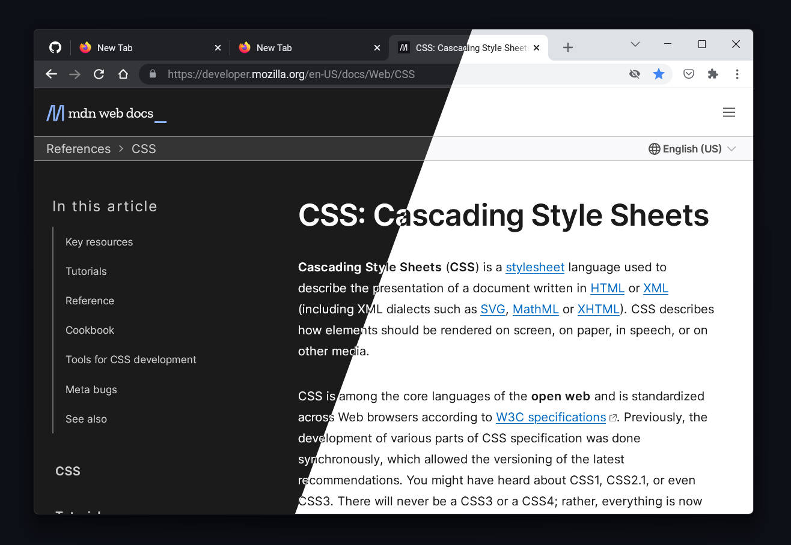
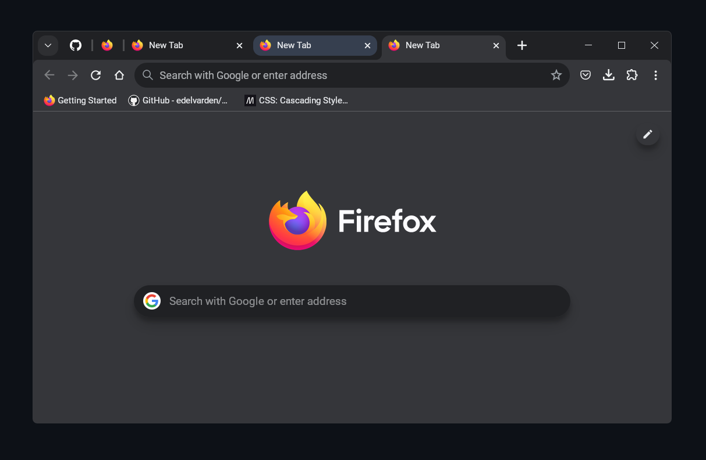
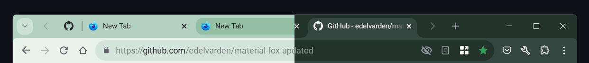
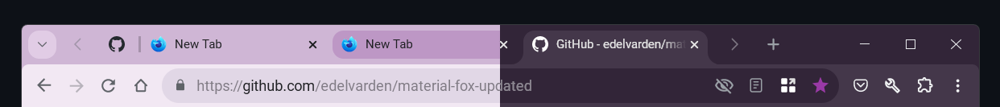
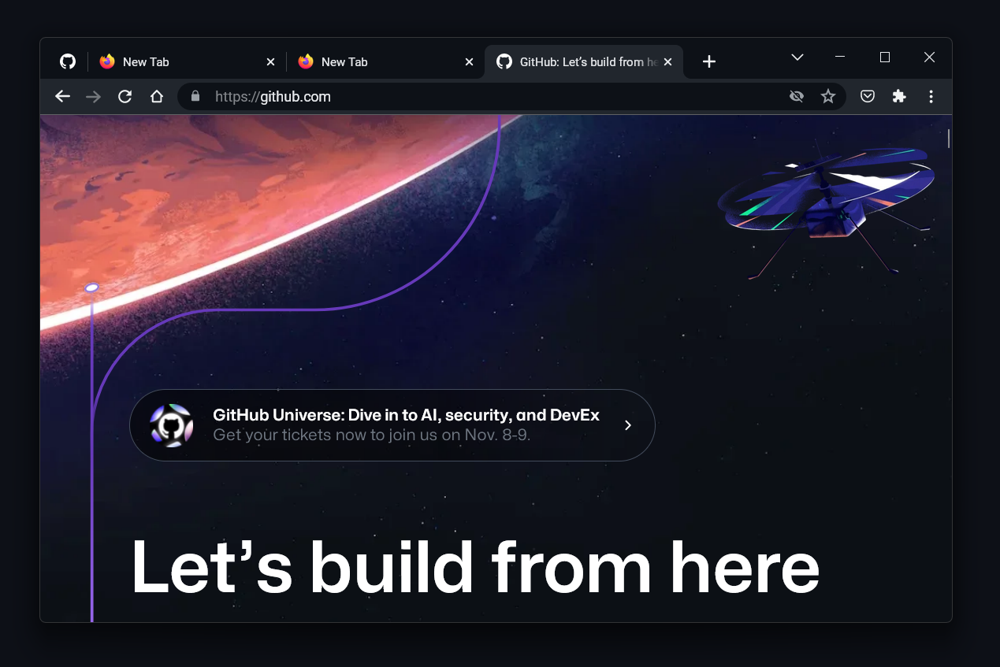
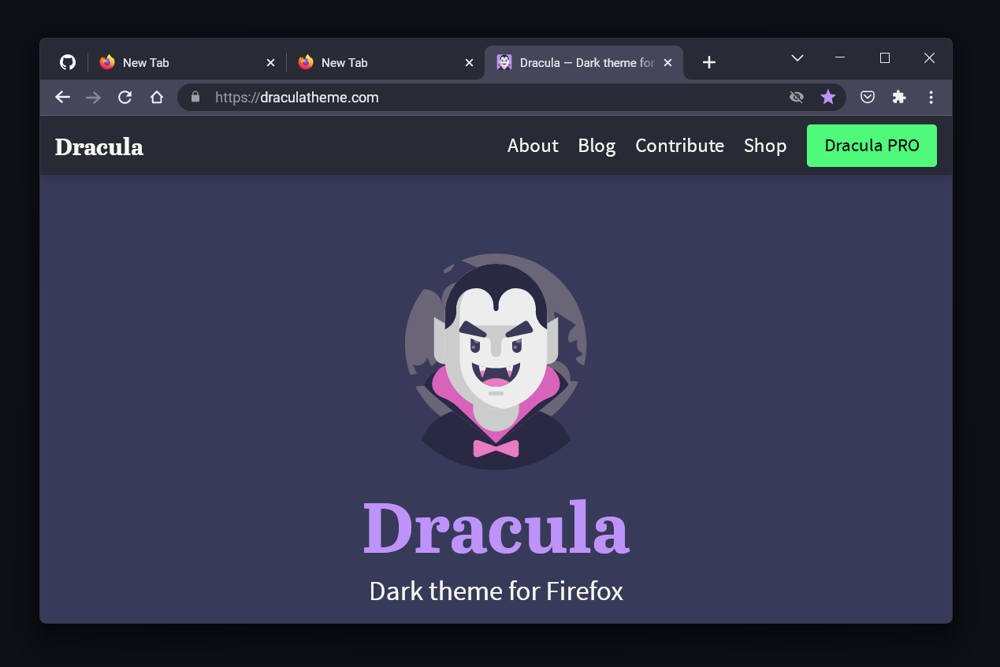
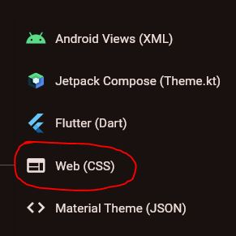

<h1 align="center">
  🦊 MaterialFox UPDATED
</h1>

<h2 align="center">
  A Firefox user CSS theme that looks similar to Chrome.
</h2>



## 🚀 Getting Started

To start using MaterialFox UPDATED, follow these steps:

1. **Open** Firefox and type `about:config` in the address bar, then press <kbd>Enter</kbd>.
2. If a warning page appears, **click** `Accept the Risk and Continue` to access the `about:config` page.
3. **Search** for the following preferences using the search bar at the top of the `about:config` page, and **ensure** the following preferences are `true`:

   - `toolkit.legacyUserProfileCustomizations.stylesheets`
   - `svg.context-properties.content.enabled`
   - `layout.css.color-mix.enabled`

4. **Type** `about:support` in the address bar and press <kbd>Enter</kbd>.
5. **Scroll down** to the `Profile Folder` section and **click** `Open Folder`.
6. **Download** the `chrome.zip` file from the [**latest release**](https://github.com/edelvarden/material-fox-updated/releases/latest).
7. **Extract** the contents of `chrome.zip` into your Firefox profile directory.
8. **Restart** Firefox to apply the changes.

### Installation Script (for Advanced Users)

As an alternative to manual installation, you can use a PowerShell script.

For **Windows**, run the following PowerShell command:

```powershell
$env:MATERIAL_FOX_VERSION = "latest"; PowerShell -ExecutionPolicy Unrestricted -c "iwr https://raw.githubusercontent.com/edelvarden/material-fox-updated/main/install.ps1 -useb | iex"
```

For Firefox version **119** or below (Firefox ESR, Floorp or Waterfox)

```powershell
$env:MATERIAL_FOX_VERSION = "tags/v1.0.7"; PowerShell -ExecutionPolicy Unrestricted -c "iwr https://raw.githubusercontent.com/edelvarden/material-fox-updated/main/install.ps1 -useb | iex"
```

## 💖 Support & Suggestions

If you enjoy this project and want to help me maintain it further, buying me a coffee would be greatly appreciated! [☕️](https://ko-fi.com/edelvarden)

<a href='https://ko-fi.com/edelvarden' target='_blank'></a>

Your **suggestions** and **bug reports** are also welcome on [GitHub Issues](https://github.com/edelvarden/material-fox-updated/issues).

## 🎨 Manual Customization

You can **apply** visual design changes by adding some `about:config` customization options (preferences).

To **set** a preference, **type** `about:config` in the address bar and press <kbd>Enter</kbd>.

To **enable** a preference:

1. **Create** a custom boolean preference by typing the preference name and **clicking** the plus button. For example, `userChrome.ui-chrome-refresh` enables the new Chrome design.

To **disable** a preference:

1. **Search** for it by name and **delete** the preference or toggle its state to `false`.

> [!WARNING]  
> Use only one preference with the prefix `theme`.

### Available preferences

<table>
  <tr>
    <th>Preference</th>
    <th>Description</th>
  </tr>
    <tr>
    <td><code>userChrome.ui-chrome-refresh</code></td>
    <td>Enable the new Chrome design named "Chrome Refresh".</img></td>
  </tr>
  <tr>
    <td><code>userChrome.theme-chrome-refresh</code></td>
    <td>Enable a new color scheme like in "Chrome Refresh".</img></td>
  </tr>
  <tr>
    <td><code>userChrome.theme-material</code></td>
    <td>Enable Material color schemes. <a href="#material-theme" _blank>Read more</a>.</img></td>
  </tr>
  <tr>
    <td><code>userChrome.theme-default</code></td>
    <td>Enable the default color scheme. This can be useful if you want to use it with <a href="https://addons.mozilla.org/firefox/addon/adaptive-tab-bar-colour/" _blank>Adaptive Tab Bar Color</a> or native Firefox themes</td>
  </tr>
  <tr>
    <td><code>userChrome.ui-compact-url-bar</code></td>
    <td>Make the URL bar more compact by reducing its height.</td>
  </tr>
    <tr>
    <td><code>userChrome.ui-context-menu-icons</code></td>
    <td>Display context menu icons.</td>
  </tr>
  </tr>
    <tr>
    <td><code>userChrome.ui-no-menu-icons</code></td>
    <td>Hide the menu icons</td>
  </tr>
  <tr>
    <td><code>userChrome.ui-force-animation</code></td>
    <td>Force enable control animation, because it respects the user's animation disable preference by default. <em>(Not required if you do not disable animation)</em></td>
  </tr>
  <tr>
    <td><code>userChrome.ui-force-old-icons</code></td>
    <td>Force the old icons to be used even if the <code>userChrome.ui-chrome-refresh</code> preference is enabled.</td>
  </tr>
  <tr>
    <td><code>userChrome.ui-no-ripple</code></td>
    <td>Disable ripple effect from buttons</td>
  </tr>
</table>

## Custom CSS rules

You can also add your own user CSS rules by using the `custom.css` file. Additionally, if you want to change some colors, you can override the default variable values with your own.

Follow these steps:

1. **Find and rename** the `custom_example.css` file in the root folder to `custom.css`.
2. **Open** `custom.css` in a text editor.
3. **Find** the desired variable.
4. **Add your values**. For example, set the accent color to red:

```css
:root,
html,
body {
  /* add your css variables below */
  --md-accent-color: #ea4335 !important;
}
```

5. Save the file and restart Firefox to apply changes.

> [!NOTE]  
> Using this `custom.css` file can separate your changes from the source project. You can easily back up your file and not worry about overwriting your changes when updating or reinstalling the main files.

### Available variables

<table>
  <tr>
    <th>Variable name</th>
    <th>Description</th>
  </tr>
  <tr>
    <td><code>--md-accent-color</code></td>
    <td>accent color</td>
  </tr>
  <tr>
    <td><code>--md-background-color-0</code></td>
    <td>dark tones</td>
  </tr>
  <tr>
    <td><code>--md-background-color-50</code></td>
    <td>middle tones</td>
  </tr>
  <tr>
    <td><code>--md-background-color-100</code></td>
    <td>light tones</td>
  </tr>
  <tr>
    <td><code>--md-text-primary</code></td>
    <td>main text color</td>
  </tr>
  <tr>
    <td><code>--md-text-secondary</code></td>
    <td>secondary text color</td>
  </tr>
  <tr>
    <td><code>--md-text-on-accent</code></td>
    <td>text on primary button</td>
  </tr>
  <tr>
    <td><code>--md-menu-background-color</code></td>
    <td>menu background color</td>
  </tr>
  <tr>
    <td><code>--md-menu-background-color-hover</code></td>
    <td>menu items background color on mouse over</td>
  </tr>
  <tr>
    <td><code>--md-menu-border-color</code></td>
    <td>controls border color</td>
  </tr>
  <tr>
    <td><code>--md-icon-color-primary</code></td>
    <td>navigation bar icons color</td>
  </tr>
  <tr>
    <td><code>--md-icon-color-secondary</code></td>
    <td>URL bar icons color</td>
  </tr>
  <tr>
    <td><code>--md-content-separator-color</code></td>
    <td>separator line between browser and content area</td>
  </tr>
  <tr>
    <td><code>--md-selection-text-color</code></td>
    <td>text selection color</td>
  </tr>
  <tr>
    <td><code>--md-selection-background-color</code></td>
    <td>selection background color</td>
  </tr>
</table>

> [!TIP]
> You can find more variables in the [variables/\_colors.scss](src/variables/_colors.scss) file. To use these variables, simply add the `--md-` prefix. For example, `"accent-color": #a8c7fa,` becomes `--md-accent-color: #a8c7fa;`.

### Custom css use cases

Here are some examples of how you can use the `custom.css` file:

- **Replacing** the font with your own. **Change** `"YourFontName"` to the name of your font:

  ```css
  :root,
  html,
  body {
    /* add your css variables below */
  }

  /* add your user css below */
  *,
  *::before,
  *::after {
    font-family: "YourFontName" !important;
  }
  ```

- **Removing** the separator line between the browser and content:

  ```css
  :root,
  html,
  body {
    /* add your css variables below */
    --md-content-separator-color: transparent !important;
  }
  ```

### Custom css use cases for creating your own color themes

> [!TIP]
> You can use variables to completely recolor the theme. Here are some preset examples with code:

<table>
  <tr>
    <th>Description</th>
    <th>Preview</th>
  </tr>
  <tr>
    <td>
      <h2>System accent colors</h6>
      Source code: <br><a href="examples/theme-system-accent.css" _blank>theme-system-accent.css</a>
    </td>
    <td></td>
  </tr>
  <tr>
    <td>
      <h2>Github theme</h6>
      Source code: <br><a href="examples/theme-github.css" _blank>theme-github.css</a>
    </td>
    <td></img></td>
  </tr>
  <tr>
    <td>
      <h2>Dracula theme</h6>
      Source code: <br><a href="examples/theme-dracula.css" _blank>theme-dracula.css</a>
    </td>
    <td></td>
  </tr>

</table>

## Material Theme

You can use the [Material Theme Builder](https://material-foundation.github.io/material-theme-builder/) to create a color theme from an image.

1. **Create** the `userChrome.theme-material` preference in the `about:config` page.
2. **Go to** the [Material Theme Builder](https://material-foundation.github.io/material-theme-builder/) website.
3. **Select** from the presented images, **upload** your own, or **use** the "Random color" button to **generate** a theme.
4. **Click** the "Pick your fonts" button in the bottom right corner.
5. **Skip** this step and **click** the "Export theme" button.
6. **Click** "Export" and **select** "Web (CSS)" from the dropdown menu.

   

This will download an archive of CSS files. You only need two files: `light.css` and `dark.css`. Open these in a text editor and extract the variables to your `custom.css` file. Wrap the variables in the appropriate media rule for light and dark themes.

Examples with previews
| Example | Preview |
| --- | --- |
| [theme-material-blue.css](chrome/theme-material-blue.css) |  |
| [theme-material-red.css](examples/theme-material-red.css) |  |
| [theme-material-yellow.css](examples/theme-material-yellow.css) |  |
| [theme-material-green.css](examples/theme-material-green.css) |  |

## 🔧 Build & Development (for developers)

### Prerequisites

- [Visual Studio Code](https://code.visualstudio.com/) (development environment)
- [NodeJS](https://nodejs.org/en/download) (for npm)

### Installation

1. Open Firefox profile directory in terminal.
2. Clone this repo with the following command:

```bash
git clone https://github.com/edelvarden/material-fox-updated.git chrome
cd chrome
npm install
npm run dev
```

Project structure

```plaintext
[Profile Folder]
└── chrome
    ├── chrome
    ├── src
    │   ├── user-chrome
    │   ├── user-content
    │   ├── user-chrome.scss
    │   └── user-content.scss
    ├── package-lock.json
    ├── package.json
    ├── userChrome.css
    └── userContent.css
```

3. Then you can modify the files in the `src` directory, all changes will be automatically build in the `[Profile Folder]/chrome/chrome` folder.

To subsequently start the development mode, just use the following command:

```bash
npm run dev
```

## Credits

- [MaterialFox](https://github.com/muckSponge/MaterialFox) by [muckSponge](https://github.com/muckSponge)
- [edge-frfox](https://github.com/bmFtZQ/edge-frfox) by [bmFtZQ](https://github.com/bmFtZQ)
